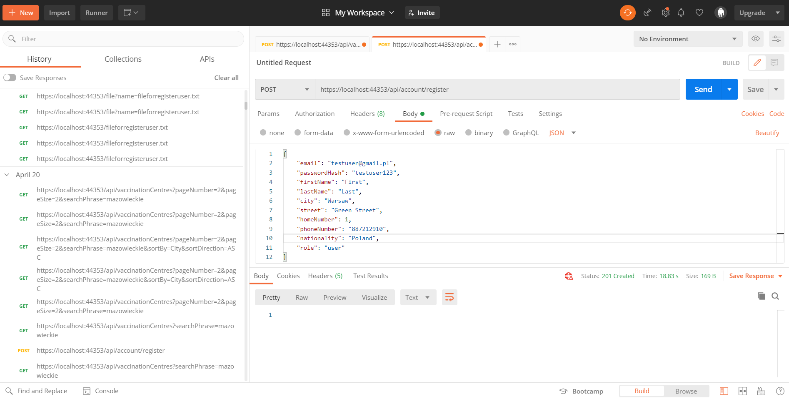
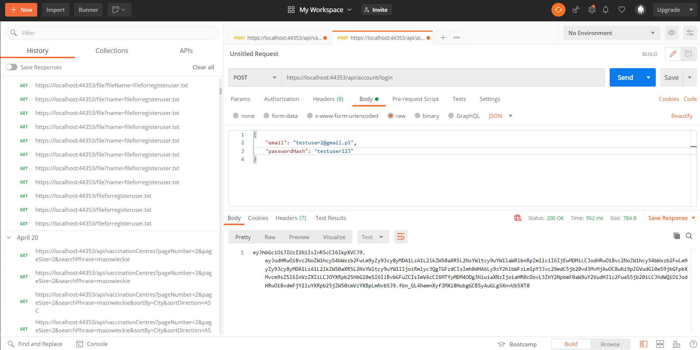
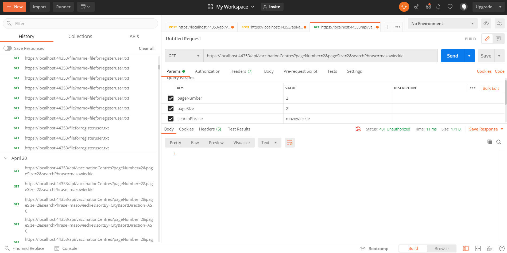

# VaccinationCentres
This project was set up for educational purposes. It was intended to be an API for displaying information about vaccination centres stored in the database with the possibility of user registration and login.

## Technologies
Project is created with:
* ASP .NET Core 3.1
* Microsoft SQL Server 2019
* Entity Framework Core
* NLog 4.7.9

## Functioning of the application
Below I illustrate how the app works with the example of creating a user, logging into an account and displaying information about the selected vaccination centre. The API has been tested using the Postman tool.

* **new user registration** - correct data not repeating in the database

* **new user registration with existing mail** - data are repeated in the database

* **login of an existing user** - the JWT token that we use for authentication is returned

* **get without authorization** - GET request for information on vaccination centre without authentication

* **get with authorization** - GET request for vaccination centre information using a pre-generated JWT token

